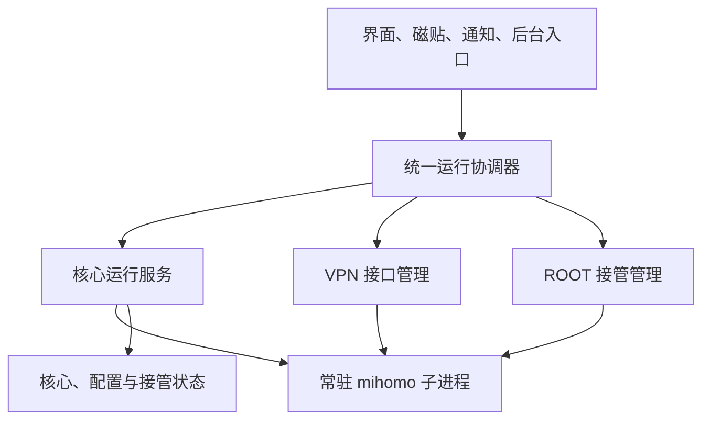

# 核心默认运行与配置重载改造目标

状态：调研与改造目标，尚未实施。本文描述目标行为，不替代现有代码和技能中的运行约束。

## 1. 范围与调研基线

目标是参考桌面版，让应用打开后默认准备核心，将核心生命周期与系统流量接管分开；能够局部更新、整份重载或重建接管资源的变更，尽量保持核心进程存活。

本次只形成方案和验收范围，不修改应用行为、不新增隧道模式、不更换代理核心。

| 调研对象 | 固定基线 | 用途 |
| --- | --- | --- |
| 安卓应用 | `43e702883308f4d8677f3b4bbff23c3ec35eeab7` | 当前入口、服务、配置管线与状态消费者 |
| 安卓实际内核 | `Kindness-Kismet/mihomo`，`c06fceb2cfdaa7c7eefa9fb5d62f1dfc1751d641` | 实际编译的接口限制、安卓补丁与监听器行为 |
| 桌面应用 | 本地调研 `a83dcfece30383afc79bee0c48f28ac80ab51a20`；公开引用 `21d34feb6d9f498f815ee0ea94a780a33a2de7ca` | `Kindness-Kismet/stelliberty` 的核心常驻、配置应用、节点选择恢复；引用文件在两版中内容一致 |
| 原版内核 | `MetaCubeX/mihomo`，`v1.19.32` / `88dcbf7f1614a67c3b36b848ee3592dfa92ada36` | 桌面版未覆盖或保守处理的重载能力 |

原版调查使用已核对包含代理核心源码的发布标签，避免把仓库默认分支或桌面端行为当成能力依据。后续升级内核时重新核对本文的能力表。

## 2. 用户可见的目标

1. 打开应用后自动启动或接管已存在的核心，默认加载当前有效订阅。此动作不等于开启 VPN、ROOT TUN 或 ROOT TPROXY，也不主动弹出 VPN / ROOT 授权框。
2. 首页连接按钮、快捷设置磁贴及通知的连接操作控制系统流量接管。断开后核心继续运行，节点列表、测速、日志和主动经本机代理端口发起的应用请求仍可使用。
3. 增加明确的“退出并停止核心”操作，先撤销接管，再结束核心和保活服务。普通返回、隐藏界面与划掉任务卡不等同于完整退出；用户强行停止应用后不自行复活。
4. 无订阅时使用最小引导配置准备核心，接管保持关闭。当前订阅损坏时保留选择及错误信息，运行最后一次确认成功的配置；没有可用快照时只启动引导核心，不能显示“代理已连接”。
5. 保存设置、切换订阅、更新当前订阅及修改覆写后，通过统一配置应用入口自动生效。保持原有“更新后自动应用”开关的选择；关闭时明确显示有待应用配置。
6. 界面分别显示“核心状态”“接管状态”“配置应用状态”。重载失败后显示实际仍在使用的订阅与版本，不把已保存的设置冒充已生效设置。
7. 开机自启与打开应用自动连接继续控制接管意图。默认准备核心不擅自扩大成开机接管，也不因更新订阅、读取设置或后台广播创建应用进程就无条件启动前台服务。

引导配置提供管理接口，并按应用下载需求准备仅回环监听的 mixed-port，节点列表为空且全部系统接管关闭。已加载有效订阅时，用户明确配置的代理监听按设置保留；“断开”只撤销系统接管，“退出并停止核心”才关闭这些监听，界面须说明这个区别。

“默认运行”指受安卓生命周期约束的后台服务行为，不承诺系统杀进程、撤销权限或限制前台服务后仍永久存活。

## 3. 已确认的源码结论

| 结论 | 源码依据 | 对安卓改造的影响 |
| --- | --- | --- |
| 桌面托盘启动时准备核心，系统代理随后独立处理 | [桌面启动入口][pc-start]、[核心宿主][pc-host] | 可以参考生命周期分离，不能照搬桌面保活方式 |
| 桌面无订阅或生成配置失败时能够启动空配置 | [桌面引导配置][pc-bootstrap] | 安卓可使用引导核心；不照搬失败后清除当前选择的行为 |
| 桌面普通模式和服务模式都优先调用 `PUT /configs?force=true` | [普通核心应用][pc-runtime]、[服务核心应用][pc-service]、[核心接口客户端][pc-api] | 全量配置可以进程内重载；重载与重启应有不同结果 |
| 桌面将控制器地址、密钥和 `keep-alive-interval` 列为重启字段 | [桌面差异判定][pc-diff] | 此列表只是桌面策略，不能直接成为安卓能力白名单 |
| 原版全量应用会更新保活间隔、空闲时间、统一延迟、Geodata 等 | [原版执行器][up-executor] | 保活间隔不应列为安卓必重启项；既有连接效果另行验收 |
| 原版 `PUT /configs` 调用 `executor.ApplyConfig`，不包含控制器重绑定 | [原版配置接口][up-config]、[原版完整应用入口][up-hub] | 控制器和密钥变化需要专门处理，不能收到成功响应就认为端点已变 |
| 原版全量应用返回值不足以证明所有资源应用成功 | [原版执行器][up-executor]、[监听器管理][up-listener] | 端口占用、TUN 创建失败还需结构化结果与应用后核验 |
| TUN 配置相同时保留监听器并执行 `OnReload`；不同时先关闭再创建 | [当前监听器管理](../../third_party/mihomo/listener/listener.go) | 普通配置重载应保留隧道；TUN 变化需要单独管理资源交接 |
| 安卓构建标签 `android && cmfa` 默认启用嵌入限制 | [当前安卓路由补丁](../../third_party/mihomo/hub/route/patch_android.go) | 独立子进程也受限制，不能直接开始调用配置写入接口 |
| 安卓运行入口缓存配置内容，重载信号复用该内容；变换只在启动阶段执行 | [当前运行入口](../../android/app/src/main/native/stelliberty_core/runtime.go) | 只发送重载信号不能保证新订阅、覆写或链式代理生效 |
| 安卓会注入 DNS 默认值并限制 VPN 字段，运行覆写还固定 profile 策略 | [当前配置补丁](../../third_party/mihomo/config/patch_mishka.go)、[运行覆写](../../android/app/src/main/kotlin/com/stelliberty/android/service/RuntimeOverrideBuilder.kt) | 比较和回报最终有效值，避免保存了一个实际被覆盖的值却显示成功 |
| 原版文件启动路径保留空的配置字节，由解析器重新读取；内联配置路径仍复用字节 | [原版入口][up-main]、[原版解析入口][up-hub] | 不能把“原版支持信号重载”理解为所有启动方式都会重新读取文件 |
| 桌面重载后关闭全部连接，并恢复节点选择 | [桌面核心接口][pc-api]、[选择恢复包装器][pc-selection] | 安卓需明确断连策略，并处理同进程重载后的选择恢复 |

## 4. 生命周期与所有权

### 4.1 唯一核心宿主

由一个核心运行服务统一持有 `MihomoRunner`、控制通道、进程判活、配置应用队列与通知。VPN 服务只负责系统授权、接口建立和描述符交接；ROOT 接管适配器负责 TUN / TPROXY 外部资源。现有两个服务不能继续各自拥有一套核心启停逻辑。

建议将状态拆为三个独立维度，名称可在实施时按项目风格调整：

| 维度 | 至少包含 | 权威来源 |
| --- | --- | --- |
| 核心 | 停止、启动中、就绪、停止中、异常 | 核心宿主与目标进程探测 |
| 接管 | 关闭、等待授权、建立中、已启用、撤销中、异常 | VPN / ROOT 资源实际状态 |
| 配置 | 已应用、待应用、准备中、应用中、失败 | 配置协调器与核心回执 |

同时记录进程代数、配置修订号、接管代数、期望订阅和实际生效订阅。配置修订号变化不要求 PID 变化；用户选择的隧道模式与实际运行模式也分别记录。

### 4.2 事件语义

| 事件 | 核心行为 | 接管行为 |
| --- | --- | --- |
| 首次打开应用 | 幂等准备核心，资源解压和配置准备放后台 | 默认不接管；已有自动连接意图另行执行 |
| 界面重建、重新打开 | 核对进程归属并连接已有实例 | 保持现状，不重复授权或建立接口 |
| 点击连接 | 核心未就绪时先准备 | 按当前模式申请必要授权并建立接管 |
| 点击断开 | 保持就绪及控制接口 | 取消未完成接管请求并撤销当前接管 |
| 保存设置、切换配置 | 应用最新候选配置 | 未开启的接管不得被配置应用顺带开启 |
| 删除最后一条订阅 | 应用引导配置，核心保留 | 关闭接管；不继续宣称使用已删除订阅 |
| VPN 授权被撤销、其他 VPN 接替 | 核心可保留 | 关闭全部相关描述符并准确显示断开 |
| 核心崩溃 | 清理所属资源，按期望状态有限退避恢复 | 不保留失效路由；没有连接意图时不重建接管 |
| 完整退出 | 取消自动恢复和应用队列，停止核心与宿主 | 先撤销接管，确认清理结果 |
| 开机或包替换 | 遵守现有开关、安卓启动限制和版本归属检查 | 按接管意图恢复，不用“核心曾运行”代替用户意图 |

普通应用身份与 ROOT 身份之间切换允许更换核心进程。ROOT TUN 与 ROOT TPROXY 的互切属于接管资源转换，目标是不重启同一 ROOT 核心。

### 4.3 安卓后台边界

- 核心持续运行时由实际工作的前台服务承载，补齐相应权限、通知及 `specialUse` 子类型声明；从界面等允许的入口启动，处理系统拒绝启动的结果。
- 不把 `Application.onCreate` 当成无条件启动点：订阅闹钟、备份、磁贴等入口都可能只短暂创建应用进程。
- 应用进程与普通子进程仍受安卓回收限制。重连必须核验 PID、可执行文件、运行目录、启动会话和鉴权，不能只检测端口。
- ROOT 重连沿用已有进程归属与开机代数检查；运行身份升级、安装包替换、失效程序路径等情况走受控重启。
- 从现有版本迁移时明确旧 `SERVICE_WAS_RUNNING`、ROOT 持久化状态与新接管意图的映射，只迁移一次；不把核心默认运行写成用户已开启自动连接。
- 不用持续唤醒锁或后台高频轮询实现常驻。界面统计继续按可见性启停，核心管理与日志采集按服务生命周期工作。

依据：[前台服务后台启动限制][android-fgs]。

## 5. 配置生效能力表

动作按以下顺序选择最小必要范围：无需运行操作 → 局部更新 → 整份配置重载 → 重建接管资源 → 核心进程重启。重建接管资源可以与配置重载组合，不自动升级为进程重启。

| 配置或操作 | 目标动作 | 关键约束 |
| --- | --- | --- |
| 主题、布局、界面日志筛选、应用更新渠道 | 无核心操作 | 应用日志等级按应用日志器能力处理，区别于核心日志等级 |
| 出站模式、核心日志等级、并发连接、进程匹配、核心 IPv6 开关 | 优先局部更新 | 当前原版配置接口包含对应字段；核心日志订阅参数也要更新 |
| 出站网卡 `interface-name` | 优先局部更新 | 原版接口支持；与 TUN 自动探测、底层网络切换及网卡缓存协调，不能将出站绑定到自身 TUN |
| 全局 `routing-mark` | 整份重载 | 原版执行器支持更新；安卓须保留 Netd 标记语义、平台预留位与自身流量绕过，不能把全局出站标记直接当成 TPROXY 接管标记 |
| 嗅探总开关 | 核验字段语义后局部更新 | 运行时 `sniffing` 与配置中的完整 `sniffer` 不可直接当成同一结构 |
| 嗅探规则、强制域名、跳过域名、完整 DNS 配置、hosts、FakeIP 参数 | 整份重载 | DNS、缓存和已有映射要有明确处理策略；不能仅清空界面缓存 |
| 统一延迟、Geodata 模式及加载器、保活参数、用户代理标识、ETag | 整份重载 | 原版执行器有运行时设置逻辑；既有连接不保证自动采用新参数 |
| 出站信任证书、NTP、experimental、入站 TFO / MPTCP 等原版字段 | 按字段语义整份重载 | 原版执行器有对应处理；保留平台权限和功能边界，不以补全能力表为由新增设置页或开放系统时间修改 |
| HTTP / SOCKS / mixed / redir / TPROXY 端口、绑定地址、局域网访问 | 局部更新或整份重载 | 同 PID 重建相关监听器；端口冲突必须失败回报与回滚；更新下载客户端实际端口 |
| 监听认证、完整 listeners / tunnels、其他协议入站配置 | 整份重载 | 管理允许的入站范围，并核验实际监听结果；运行时接管字段由平台掌握 |
| 节点选择、解除固定、provider 刷新、DNS 缓存清理、关闭连接 | 专用接口 | 沿用已有接口，不为了这些操作重载整份配置；维护应用持久化状态 |
| `profile.store-selected` / `store-fake-ip` | 平台策略不变时无操作；有效策略确需变化时整份重载 | 当前安卓强制前者关闭、后者开启；保留应用节点选择的权威来源及 FakeIP 持久化，不能因覆写文件改变就显示已应用 |
| 当前订阅切换或内容更新、覆写、链式代理、规则覆写 | 整份重载 | 先完成变换和校验，再恢复目标订阅节点选择；应用后更新生效订阅标识 |
| 非当前订阅更新、仅改名称或更新时间等元数据 | 通常无核心操作 | 以最终运行配置差异为准；通知名称等应用状态单独更新 |
| 用户覆写字段从具体值清空为“跟随订阅” | 重新生成有效配置并局部更新或重载 | 不能发送 `null` 并假定核心恢复默认；很多局部接口把空值解释为不修改 |
| VPN 的 DNS、地址、路由、分应用名单、绕过权限、系统代理、MTU | 重建 VPN 接口并交接描述符 | 属于 `VpnService.Builder` 的配置，单独更新核心不能改变系统接口 |
| VPN 的协议栈、核心侧 TUN 参数 | 重建核心 TUN 监听器，必要时交接新的描述符副本 | 保持核心 PID；描述符所有权必须先实现 |
| ROOT TUN 开关、协议栈、设备、MTU / GSO、排除路由、应用名单 | 重建相关 TUN / 路由资源 | 内核能够重建 TUN；应用额外维护的热点规则同时协调 |
| ROOT TPROXY 开关、应用名单、IPv6、DNS 端口和热点策略 | 更新监听器及所属防火墙 / 策略路由 | 接管开启前确认监听器就绪；撤销后才关闭被引用的监听器 |
| ROOT TUN 与 ROOT TPROXY 互切 | 撤销旧接管、重载、建立新接管 | 核心运行身份不变时保持 PID；不得短暂同时接管 |
| 控制器地址、密钥、TLS / Unix 控制器、控制器证书与跨域等设置 | 专门的控制器重绑定 | 普通 `PUT /configs` 不处理这些字段；需要稳定管理通道、结果核验和客户端迁移 |
| 自动更新地理资源与 GeoIP 文件替换 | 专用更新或资源替换后重载 | 与解析、provider 加载和共享资源写入串行；不能覆盖正在使用的文件 |
| 核心二进制升级、应用身份与 ROOT 身份转换、进程级运行环境变化 | 受控重启 | 属于真正进程边界；保留用户接管意图和最后成功配置 |
| 显式“重启核心”、核心已死或确认无法恢复的运行状态 | 受控重启 | 重载请求不能无理由变成重启；错误中说明实际执行了哪种动作 |

补充要求：

- 对比经过默认值解析、订阅变换及平台注入后的有效配置，不仅比较用户覆写文件。值未变化时不进行运行操作；网络或接管资源代数改变仍须核验对应资源。
- 有效配置包含当前 `patch_mishka.go` 的 DNS 默认注入、VPN 字段白名单及运行覆写中的 profile 策略。被平台强制覆盖的设置要显示限制原因，不得以原始 YAML 的值作为生效回执。
- 单独建立局部更新字段白名单。未知字段不得假定已热更新，也不得因为重载会返回成功就直接标记生效。
- `GET /configs` 只回报部分通用状态，不能作为完整配置核验。其他字段结合修订快照、扩展回执和资源探测确认，回执与日志不泄露节点凭据或控制密钥。
- 原版局部 TUN 结构的 `enable` 不是可空字段。发送 TUN 子对象时必须带上正确的完整启用意图，避免只修改协议栈却关闭 TUN。
- `force=true` 表示应用监听器等完整配置，不表示进程重启，也不表示必须关闭所有已有连接。
- 对控制器变更，最终目标是受控重绑定；实现前可显式提示并走受控重启，但该过渡行为不能作为本改造最终完成标准。

## 6. 配置应用管线

### 6.1 快照与串行化

所有设置、订阅、自动更新、Wi-Fi 策略、磁贴和调试入口交给同一运行协调器。核心启动、停止、局部更新、重载、描述符交接和接管转换共用有序队列。

一次配置请求至少包含：请求编号、目标订阅、来源版本、期望配置修订号、接管意图、变更原因和连接处理策略。

处理顺序：

1. 从 Koin 单例的内存权威状态获取完整快照。编辑框未确认的内容不触发应用；连续已保存的小改动合并到最新快照。
2. 完成订阅覆写、链式代理、规则覆写、用户设置和运行时字段合成，准备候选文件及 provider 资源，先校验。
3. 对比最后成功配置并选择动作。准备期间出现更新请求时丢弃过期候选；进入不可中断的资源切换阶段后先收敛，再处理下一请求。
4. 执行核心更新和必要的系统资源操作，收集结构化结果，再核验 PID、修订号、监听器、TUN / 防火墙状态和关键有效配置。
5. 恢复目标订阅节点选择，作废旧配置相关的异步任务，更新生效状态和最后成功快照，随后处理可清理的旧资源。
6. 失败时保留期望值与错误，恢复上一成功配置和接管状态；回滚也失败时关闭受影响接管并明确报错，不能继续显示成功。

订阅处理锁只用于保证订阅及资源快照一致，不能在持有列表锁时等待网络、前台服务或核心接口。保留现有 Pending → Processing → Imported 管线及取消收尾语义。

### 6.2 受控核心接口

- 在独立运行子进程中提供受鉴权、可串行化的配置应用能力，复用原版配置解析和应用逻辑。嵌入应用进程的 JNI 导入实例继续保持隔离。
- 优先保持 `PATCH /configs`、`PUT /configs` 的兼容语义，并给本项目的应用请求增加修订号、结果和状态查询能力；禁止第二条未受协调器管理的应用链。
- 不能通过全局解除嵌入限制顺带开放 `/restart` 和 `/upgrade`。当前可执行文件是包装器，进程替换、安装包更新和退出仍由安卓宿主掌握。
- 管理通道在用户修改控制器或密钥时仍可用。将即将重绑定的用户控制器与核心管理通信分开，复用描述符交接所需的私有本地通道或等价机制。
- 控制器重绑定复用原版 `hub.ApplyConfig` 中的路由重建能力，但要补齐新端点绑定成功、旧端点退出、鉴权迁移、失败回滚及客户端重连确认；不能直接把异步创建服务器当成成功。
- 扩展 `/stelliberty/runtime` 或等价状态响应，报告进程身份、配置修订号、实际生效订阅、应用阶段、接管代数及能力版本。
- 运行中的全量应用目前会先改变多个子系统，原版没有完整事务回滚。应用层“先校验”只能减少失败，不能替代资源切换后的补偿与真实状态核验。

### 6.3 错误与连接策略

| 情况 | 处理要求 |
| --- | --- |
| 配置语法或语义被拒绝 | 保留旧配置，不重启去加载坏配置 |
| 未授权、能力不存在、任务冲突或限流 | 分别处理鉴权、能力协商、排队或退避；不能把全部客户端错误都归为配置错误 |
| 请求超时、连接在应用期间断开 | 结果视为未知，先查询请求编号和生效修订号，再决定重试；不能立即重复应用或杀进程 |
| 接口返回成功但端口 / TUN 创建失败 | 应用失败，撤销新资源并恢复旧快照；接口成功码不是最终验收 |
| 日志等级、测速行为等无路由影响的变更 | 保留已有连接 |
| 节点选择 | 沿用用户现有连接处理语义，新连接使用新节点 |
| 切换订阅、链路或影响已有会话归属的配置 | 明确关闭受影响连接；不能可靠定位时允许关闭全部连接并提示 |
| DNS / FakeIP 策略变化 | 定义缓存保留、失效和映射迁移顺序，必要时关闭受影响连接，防止旧地址映射到错误目标 |

目标是减少不必要的进程和接口重建，不承诺所有配置变更都保持已有连接完全无感。

## 7. VPN 描述符是前置改造

当前 VPN 先由 `VpnService` 建立接口，再通过 `fork+exec` 让新核心继承描述符。核心先运行后再开启 VPN 时，不能把应用进程中的描述符数字写进 JSON 就当成交接完成。

必须实现：

1. 通过受保护的本地进程通信传递描述符，例如 Unix socket 的 `SCM_RIGHTS`。接收进程获得自己的描述符编号，关联核心会话及接管代数，拒绝旧请求。
2. 明确应用持有的接口句柄、核心接收句柄及监听器使用的副本各由谁关闭。监听器重建后不得重用已关闭的编号；关闭路径幂等，失败与取消也回收副本。
3. 核心收到描述符并成功建立监听器后回执。VPN 开启、关闭、协议栈切换和多次连接都保持同一核心 PID。
4. 系统接口属性变化时重新调用 `Builder.establish()`。新接口成功建立会让旧接口失去出站流量，因此不能承诺“新核心监听器失败时旧接口仍自动可用”；需要明确的交接和重新建立旧配置方案。
5. `onRevoke`、服务销毁、核心崩溃、取消及完整退出关闭相关双方句柄，确保没有孤儿接口和无消费者的持续接管。
6. 保留现有 MTU 两侧一致、应用自身绕过、安卓 fd 路径字段白名单与 `forwarderBindInterface` 补丁。系统 DNS 更新也必须进入运行子进程，不能只写入 JNI 导入实例。

依据：[安卓接口建立契约][android-vpn]、[跨进程描述符传递][unix-fd]、[当前进程创建](../../android/app/src/main/cpp/process_helper.c)。

## 8. 常驻工作目录与配置完整性

- 进程工作目录不再随当前订阅切换。使用稳定的运行会话目录，订阅资源按订阅及修订号隔离；普通身份与 ROOT 身份的目录权限分别管理。
- 全量重载只接受本应用准备的候选内容或受限运行目录中的候选路径，满足原版安全路径约束。不能把任意文件读取能力暴露到控制接口。
- provider、规则集、相对路径、缓存和 GeoIP 都需解析到正确的运行资源命名空间，避免切换后仍访问上一个订阅或把两个订阅写进同一缓存。
- 候选内容、资源和变换快照一起生成；ROOT 可写文件仍放运行沙箱，用户 imported 目录继续属于应用。正在使用或可用于回滚的资源不能被删除、更新或备份恢复提前清理。
- 明确“用户期望快照”“候选快照”“最后成功快照”的提交点。先校验再应用，确认成功后才替换成功指针；启动恢复不能误加载上次失败候选。
- 统一启动与重载的配置管线。当前 `--transform`、`--override-json` 和 age 密钥处理不能只在启动时生效，也不能对已经完成变换的候选重复应用。
- 目标候选配置包含已确认的变换和注入结果；现有全局覆写路径等输入改为受请求快照约束，防止回滚旧 YAML 时又套入新的覆写文件。涉及 age 的敏感内容不进入日志，快照遵循现有私有文件和备份边界。
- 运行时接管字段优先于订阅。接管关闭时，顶层 TUN、额外 TUN listener、内核 iptables 自动接管及应用侧规则都必须关闭；加载当前订阅本身不得偷偷建立系统接管。
- ROOT 规则转换保留有限 xtables 锁等待、所属链及路由的清理核验、IPv6 门控、应用与核心 UID 绕过；只修改本应用拥有的规则，切换出 TUN 后同步释放自动网卡探测等全局状态。
- 外网下载按核心就绪与实际 mixed-port 决定能否使用内核，保留订阅自己的直连 / 经内核更新选择。端口更改、核心恢复和配置修订后作废旧端口缓存。
- 删除当前订阅、清空数据与恢复备份必须经过协调器：先解除正在运行的资源依赖，再完成替换和清理。无订阅时回到引导核心，不重新接管已断开的流量。

## 9. 状态消费者与用户入口

| 范围 | 必须迁移的行为 |
| --- | --- |
| `MihomoConnectionManager` | 按核心可用性建连接；接管关闭时保留。PID、管理端点或密钥变化才更换传输实例 |
| 同 PID 的全量重载 | 单独发布配置修订变化，取消旧配置请求和结果回填；不能只靠 repository 对象或 PID 识别新会话 |
| 代理、provider、规则、连接、DNS 页面 | 刷新新配置数据，恢复目标订阅选择，拒绝旧修订测速、列表和流量信息回填 |
| 节点选择恢复 | 保留应用文件作为权威来源；暂停重载期间的选择导入，恢复后再发布新配置可操作状态 |
| 首页和统计 | 分开核心运行时长与接管时长；同进程重载不虚构进程重启，不因累计计数基准变化产生速率尖峰 |
| 应用内下载 | 图标、应用更新、订阅、覆写下载及首页规则测速改用核心可用性；接管状态不作为可下载判据 |
| 自动测速、日志、前台通知 | 服务级工作与页面级刷新分离；关闭界面后核心常驻不代表界面高频刷新也常驻 |
| 设置页面 | 将统一“需要重启”提示替换为实际应用状态；仅真正进程边界显示重启说明，未提交编辑不触发应用 |
| 模式选择、分应用代理、VPN / ROOT 设置 | 核心就绪且接管关闭时允许修改；接管开启时通过协调器转换，不能再按“核心运行中”统一禁用 |
| 通知与磁贴 | 开关状态反映系统接管；核心空闲常驻不点亮“代理已连接”。完整退出有独立语义 |
| Wi-Fi 策略 | 停止动作只撤销接管；直连模式用局部更新；持久模式与临时策略覆盖仍分离 |
| 系统网络变化 | 更新底层网络、出站网卡、DNS 与连接缓存；区分网络变化和配置变化，不为 Wi-Fi / 蜂窝切换直接重启核心 |
| 启动与后台订阅更新 | 当前订阅整轮更新完成后统一应用一次；非当前订阅不扰动运行核心；失败和取消不发布成功状态 |
| 开机、包替换、自动连接 | 核心存在与接管期望分开持久化，沿用用户开关；新版本启动清理旧运行程序时核验归属 |
| 备份、恢复及调试命令 | 不备份运行期 PID、描述符或代数；调试区分核心启停、接管启停、配置应用与显式重启 |

## 10. 代码改造清单

| 层次 | 主要位置 | 改造目标 |
| --- | --- | --- |
| 启动与依赖注入 | `MainActivity`、`StellibertyApplication`、`di/` | 合法入口准备核心，单例运行协调器及统一宿主 |
| 生命周期 | `ProxyServiceController`、`ProxyServiceState`、`MihomoRunner`、两个代理 Service | 拆分状态与进程所有权，消除每种接管模式各自启停核心 |
| 系统接管 | `RootHelper`、`RootProcessScript`、`RootTproxyApplier`、`RootTetherHijacker`、VPN Service | 接管资源应用、撤销、重建与恢复独立于进程生命周期 |
| 原生边界 | `process_helper.c`、JNI 桥、`stelliberty_core/runtime.go`、`runtime_probe.go` | 描述符交接、版本化应用回执、统一配置加载与真实就绪检查 |
| 内核扩展 | mihomo 路由、执行器与监听器；项目原生扩展入口 | 最小开放受控配置能力，保留嵌入隔离；结构化资源错误与控制器重绑定 |
| 配置与文件 | `RuntimeOverrideBuilder`、`ConfigGenerator`、`ProfileTransformWriter`、`ProfileFileOps` | 有效配置差异、固定运行目录、修订快照和补偿清理 |
| 数据与后台 | 订阅 / 覆写 / 链式代理 / 规则仓库、`ProfileWorker`、`BackupManager` | 统一请求应用，保存与生效分离，保持订阅原子性和取消边界 |
| 网络客户端 | `data/api/`、`SubscriptionProxyResolver`、`IconLoader`、应用更新仓库 | 核心可用性与配置修订驱动连接、缓存及结果归属 |
| 界面与入口 | 各 ViewModel、首页、设置、日志、通知、磁贴、Wi-Fi 和自动连接 | 新状态语义、最小动作反馈和失败后实际状态 |
| 维护资料 | `AGENTS.md`、服务 / 接口 / 原生 / 订阅 / 调试技能，两份技能目录 | 实现完成时更新旧的“配置变更必重启”和调试契约；本阶段不提前改写现行约束 |

搜索迁移时不能只替换 `restart()`：同时核对 `restartWhenReady`、`restartAfterProfileUpdate`、`onActiveSubscriptionChanged`、界面中的重启回调，以及所有将 `ProxyState.Running` 当成 API 可用性的消费者。

## 11. 分阶段交付

| 阶段 | 交付物 | 进入下一阶段的条件 |
| --- | --- | --- |
| 一：能力与结果契约 | 原生应用入口、能力版本、修订查询和配置动作判定 | 在目标内核验证局部更新、全量重载、错误拒绝及监听失败结果 |
| 二：运行配置快照 | 统一生成器、固定目录、候选 / 成功快照、资源隔离 | 覆写、链式代理、规则、provider 相对路径及失败恢复可验证 |
| 三：核心与接管分离 | 唯一宿主、三维状态、引导核心、完整退出和前台通知 | 默认启动不接管；界面退出不误停；受限启动如实失败 |
| 四：VPN 描述符交接 | 私有通道、句柄所有权、接口交接与撤销 | VPN 开关、协议栈及系统接口属性变更保持核心 PID，句柄无泄漏 |
| 五：ROOT 接管转换 | 同进程切换 TUN / TPROXY、规则重建和恢复 | 本机与热点网络正确，取消、崩溃、重开应用后无残留或双重接管 |
| 六：完整应用体验 | 控制器重绑定、节点恢复、下载、后台入口和全部界面迁移 | 能力表中的非进程边界变更不再依赖核心重启 |
| 七：回归与旧路径清理 | 三模式验收记录、稳定性报告、资料更新和原子提交 | 无重复状态源、失效重启提示、旧配置应用入口或多余兼容代码 |

每一阶段保持应用可运行。实验入口通过验证前不替换默认稳定路径；最终验收覆盖完整目标，不能把临时保留的重启方案当作已完成的热重载能力。

## 12. 验收矩阵

不在本阶段新增单元测试。实施时按项目要求完成编译、原生打包、新增界面的稳定性报告及模拟器 / 真机验证；VPN 系统链路必须包含真机。记录实际设备能力，不把某个模拟器结果推广为所有安卓设备。

| 编号 | 场景 | 必须观察到的结果 |
| --- | --- | --- |
| A01 | 关闭自动连接后，无订阅或已有订阅打开应用 | 核心就绪且 API 可用；不弹 VPN / ROOT 窗口；系统接管关闭；引导配置仅回环监听 |
| A02 | 打开失败订阅、上次应用失败后冷启动 | 旧成功配置或引导核心可辨识；错误保留，不伪装已应用目标订阅 |
| A03 | 核心就绪、接管关闭时查看节点、测速、获取日志和下载 | 有效订阅对应功能可用；下载符合订阅更新模式和实际 mixed-port，未提供代理监听时不伪装经核心下载 |
| A04 | VPN / ROOT TUN / ROOT TPROXY 反复连接、断开 | 同身份核心 PID 不变；接口、描述符和规则数量不持续增长 |
| A05 | 修改出站模式、核心日志等级、并发连接、进程匹配与出站网卡 | 使用局部更新；配置回读一致；无关连接不断开，出站不回流自身 TUN |
| A06 | 修改 DNS、嗅探规则、统一延迟、Geodata、保活、路由标记及其他原版字段 | 按能力表重载且 PID 不变；新请求行为变化；缓存和平台标记约束正确；DNS 被强制注入时如实显示 |
| A07 | 修改端口、局域网访问及认证；故意占用目标端口 | 成功时监听正确，失败时恢复旧配置；不把接口成功码当成监听成功 |
| A08 | 当前订阅切换、当前 / 非当前订阅更新、批量和启动更新 | 目标订阅与选择正确；批量只统一应用一次；非当前订阅不扰动运行配置 |
| A09 | 覆写、脚本、链式代理、规则覆写、age 订阅 | 启动与重载生成相同有效配置；不存在只重载原始 YAML 的旁路 |
| A10 | 两个订阅使用同名 provider 及相对路径 | 缓存、资源和实时流量归属不串号；旧修订请求不会污染新订阅 |
| A11 | 清空覆写字段、修改后恢复默认值、修改 profile 持久化字段 | 生效值回到订阅或真实默认值，旧运行值不残留；平台强制策略可辨识，节点选择及 FakeIP 缓存不串号 |
| A12 | VPN 分应用、DNS、路由、IPv6、系统代理、MTU 和协议栈变化 | 系统接口与核心两侧一致；核心 PID 不变；实际流量通过新接口 |
| A13 | VPN 拒绝授权、撤销、另一 VPN 接替、接口交接失败 | 接管状态准确，句柄回收完整；核心可用性独立处理 |
| A14 | ROOT 两模式互切、热点启停、热点接口变化、IPv6 开关 | 同 ROOT PID，路由和防火墙无双重接管；失败能补偿恢复 |
| A15 | 修改控制器地址、密钥或证书；新端点绑定失败 | 管理通道仍可查询；成功迁移客户端，失败恢复旧端点；最终不依赖进程重启 |
| A16 | 连续改设置、应用期间切订阅、同时断开、取消准备 | 最后期望状态生效；过期回执不覆盖新状态；断开不被排队请求重新开启 |
| A17 | 配置应用超时、接口掉线、程序在应用中崩溃 | 能区分已应用、未应用和未知；无重复应用或无条件重启循环 |
| A18 | 用户选择恢复、旧测速回包、日志等级变化、累计计数变化 | 数据归属正确，节点选择不回退，统计不出现虚假尖峰 |
| A19 | 删除当前 / 最后一条订阅，恢复备份、清空数据 | 运行资源先解除依赖；引导核心和实际接管状态一致；无旧目录误删 |
| A20 | Wi-Fi 停止 / 直连策略、通知、磁贴、开机、包替换及旧版状态迁移 | 使用接管意图，不能把核心常驻解释成用户要求连接；迁移不扩大自动连接设置 |
| A21 | 前后台切换、任务卡移除、系统回收、完整退出和强行停止 | 符合生命周期约定；允许恢复时核验归属；完整退出不自行重启 |
| A22 | 更新核心、普通与 ROOT 身份切换 | 仅这些进程边界按需重启；恢复成功配置、节点选择和接管意图 |
| A23 | 关闭接管时加载含 TUN listener 或自动防火墙字段的订阅 | 核心仍不接管系统流量；平台运行字段不会被订阅覆盖 |
| A24 | 重载、Wi-Fi / 蜂窝切换后的网络实测与资源检查 | 同时验证真实 TCP / UDP、域名解析、IPv4 / IPv6、句柄及规则；不能只看 PID 或测速接口 |

记录每类操作的实际动作、PID、配置修订号、接管代数、应用耗时、连接影响和失败恢复结果。性能提升以同设备同配置的测量为依据。

## 13. 遗漏审查结论与实施前验证项

本次按“配置字段 → 调用入口 → 状态消费者 → 资源所有权 → 失败恢复 → 验收场景”复核，以下容易遗漏的事项已纳入目标：

- 桌面保守重启字段与原版真实能力不一致，尤其是保活参数。
- 配置接口成功不等于 TUN、DNS 或其他监听器实际就绪；原版应用也不提供完整原子回滚。
- 常驻核心开启 VPN 需要跨进程交接句柄，原先启动时继承的方式不足以覆盖反复连接。
- 同 PID 重载不会自动触发现有 repository 更换，必须另有配置修订与选择恢复通知。
- 当前运行目录、相对 provider 路径、age 与覆写输入都和启动流程绑定，必须随重载一起改造。
- 关闭系统接管后，节点接口和应用内下载应继续可用；通知、磁贴和 Wi-Fi 策略仍按接管状态工作。
- 当前设置页存在只保存、不自动请求运行应用的路径，必须纳入统一应用观察和调度。
- 删除最后一条订阅、失败候选恢复、用户退出、授权撤销及后台创建应用进程都有独立语义。
- 控制器重绑定、错误分类、未知结果查询、字段清空和全量断连策略均不能直接照搬桌面实现。
- 出站网卡、路由标记、profile 持久化与安卓强制注入均纳入能力表；不能只按用户配置或不完整的 `GET /configs` 判断全部字段已生效。
- 引导监听范围、旧版状态迁移、系统网络切换，以及断开后继续存在的用户代理监听都有明确语义。

仍需通过实施验证、不能仅凭静态调研宣布支持的项目：

1. 目标安卓版本和实际 ROOT 权限环境下，前台宿主及私有描述符通道的完整生命周期。
2. 当前 TUN 实现关闭描述符的具体所有权，与重复交接、接口替换、回滚路径的一致性。
3. DNS / FakeIP 映射迁移、长连接保留和 provider 资源更新的真实业务效果。
4. 控制器绑定失败、系统接管失败和多子系统部分应用失败时，结构化结果及补偿动作的可靠性。
5. 长时间空闲、应用回收、ROOT 进程独立存活、系统网络切换和热点变化下的恢复行为。

这些项目已经分配到阶段和验收矩阵，属于完成改造的必要验证条件。当前成果仅是文档调研和遗漏审查，不代表已经获得设备验证结论。

## 14. 参考源码与平台文档

远程源码链接固定到提交，当前安卓的相对链接以第一节记录的基线为准，正文按结论就近引用。桌面引用版本与本地调研版本的八个引用文件逐一比对一致；平台文档用于限定服务生命周期和描述符交接契约，不视为本应用已经实现这些能力。

[pc-start]: https://github.com/Kindness-Kismet/stelliberty/blob/21d34feb6d9f498f815ee0ea94a780a33a2de7ca/src/Stelliberty.Tray/TrayRuntime.cs
[pc-host]: https://github.com/Kindness-Kismet/stelliberty/blob/21d34feb6d9f498f815ee0ea94a780a33a2de7ca/src/Stelliberty.Tray/TrayCoreRuntimeHost.cs
[pc-bootstrap]: https://github.com/Kindness-Kismet/stelliberty/blob/21d34feb6d9f498f815ee0ea94a780a33a2de7ca/src/Stelliberty.Application/Runtime/StartupBootstrapConfigBuilder.cs
[pc-runtime]: https://github.com/Kindness-Kismet/stelliberty/blob/21d34feb6d9f498f815ee0ea94a780a33a2de7ca/native/hub/src/infra/core_runtime.rs
[pc-service]: https://github.com/Kindness-Kismet/stelliberty/blob/21d34feb6d9f498f815ee0ea94a780a33a2de7ca/native/service/src/core.rs
[pc-api]: https://github.com/Kindness-Kismet/stelliberty/blob/21d34feb6d9f498f815ee0ea94a780a33a2de7ca/native/hub/src/infra/core_api.rs
[pc-diff]: https://github.com/Kindness-Kismet/stelliberty/blob/21d34feb6d9f498f815ee0ea94a780a33a2de7ca/native/hub/src/util/yaml_diff.rs
[pc-selection]: https://github.com/Kindness-Kismet/stelliberty/blob/21d34feb6d9f498f815ee0ea94a780a33a2de7ca/src/Stelliberty.Application/Proxies/ProxySelectionRestoringCoreManager.cs
[up-config]: https://github.com/MetaCubeX/mihomo/blob/88dcbf7f1614a67c3b36b848ee3592dfa92ada36/hub/route/configs.go
[up-executor]: https://github.com/MetaCubeX/mihomo/blob/88dcbf7f1614a67c3b36b848ee3592dfa92ada36/hub/executor/executor.go
[up-hub]: https://github.com/MetaCubeX/mihomo/blob/88dcbf7f1614a67c3b36b848ee3592dfa92ada36/hub/hub.go
[up-listener]: https://github.com/MetaCubeX/mihomo/blob/88dcbf7f1614a67c3b36b848ee3592dfa92ada36/listener/listener.go
[up-main]: https://github.com/MetaCubeX/mihomo/blob/88dcbf7f1614a67c3b36b848ee3592dfa92ada36/main.go
[android-vpn]: https://developer.android.com/reference/android/net/VpnService.Builder#establish()
[android-fgs]: https://developer.android.com/develop/background-work/services/fgs/restrictions-bg-start
[unix-fd]: https://man7.org/linux/man-pages/man7/unix.7.html
